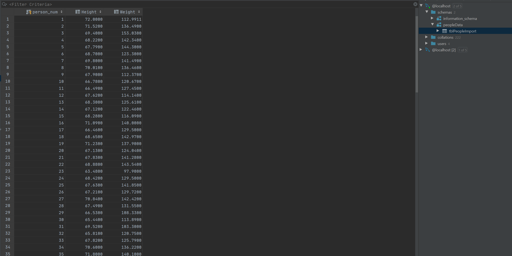
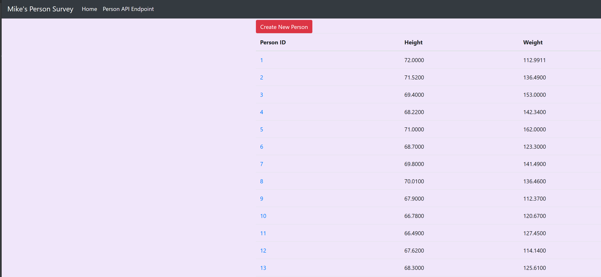
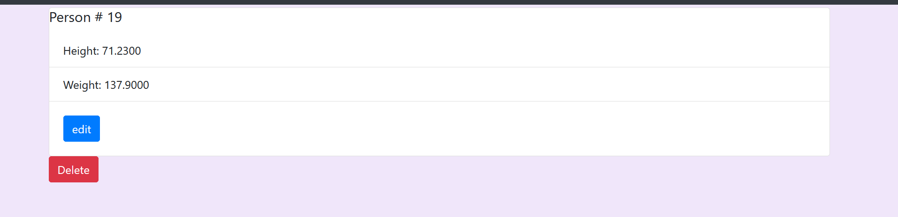
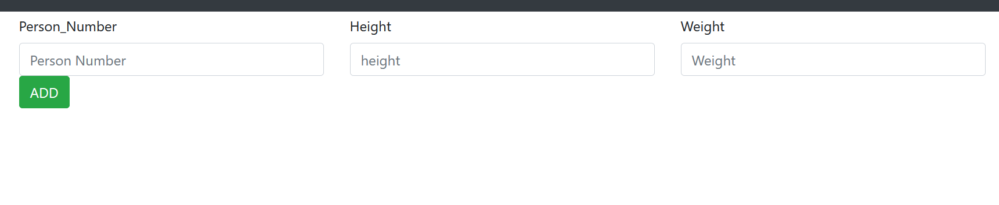
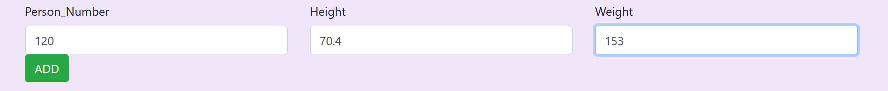
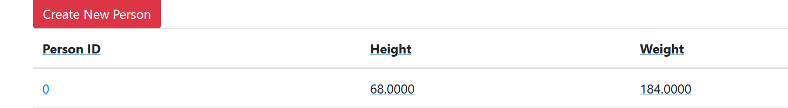
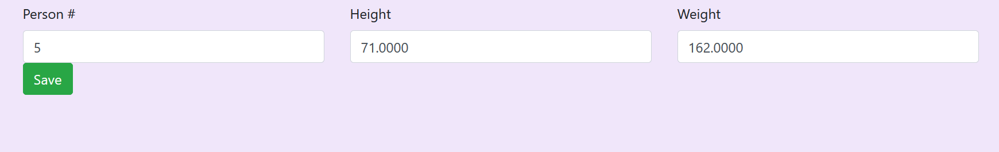
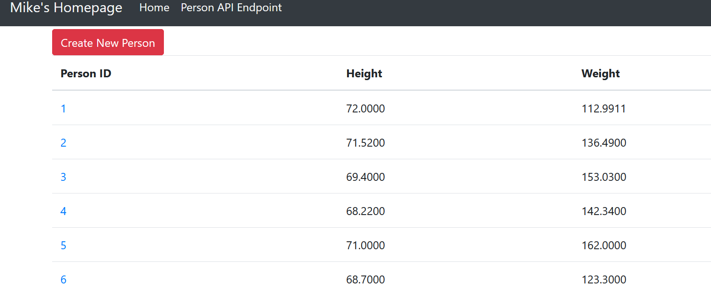

# Project Description
A project to create a flask framework to serve flask jinja template files and send http POST requests to update, add new records, and delete.  

a. The project showing that you can view YOUR data tables in PyCharm

b. YOUR project running correctly in the browser displaying your homepage with your data

c. YOUR project running correctly in the browser displaying your data record as a view of one record

d. YOUR project running correctly in the browser displaying a new record added to your home page

e. YOUR project running correctly in the browser displaying an updated record added to your home page

## original:

## Edit

## Updated

