# Project Description
 A project to create a flask framework to serve flask jinja template files and send API requests using Postman

### Results:

### A. Project listing all records:

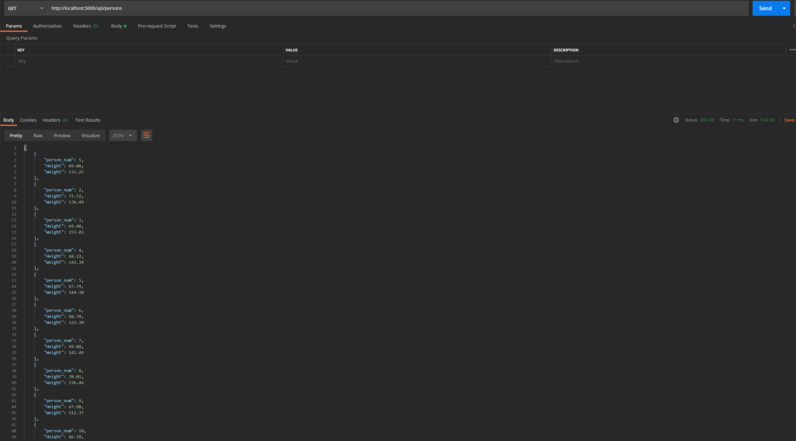

### B. Project listing one record:
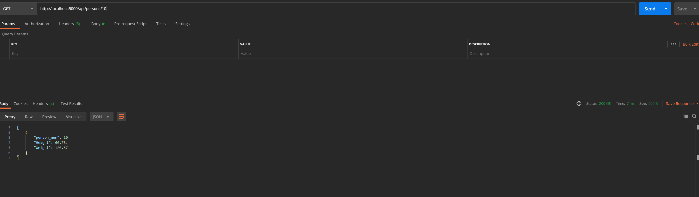

### C. Create a record:
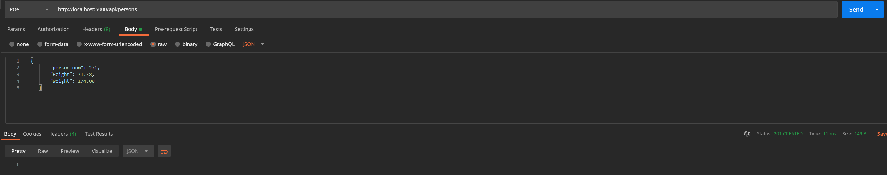

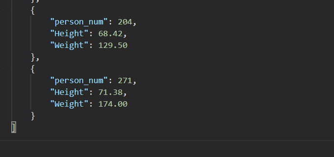

### D. Edit a record:

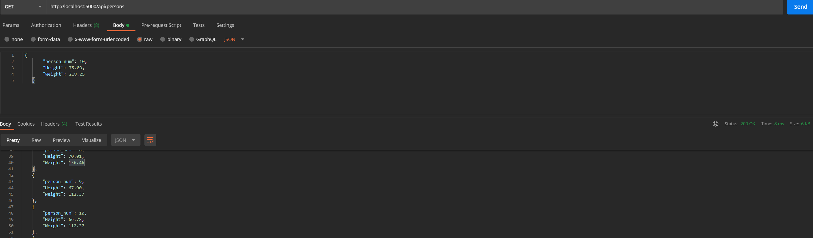

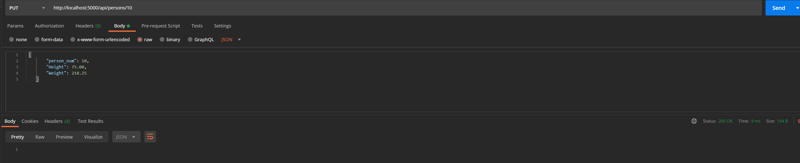

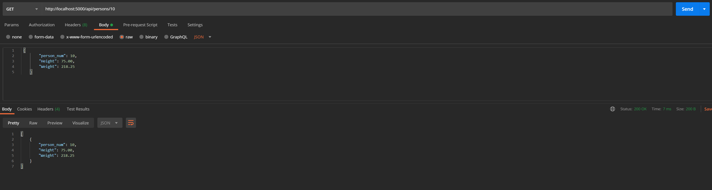

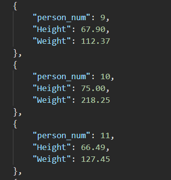

### E. Delete a record:

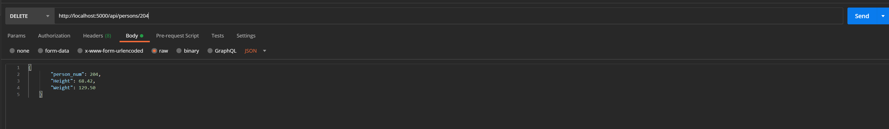

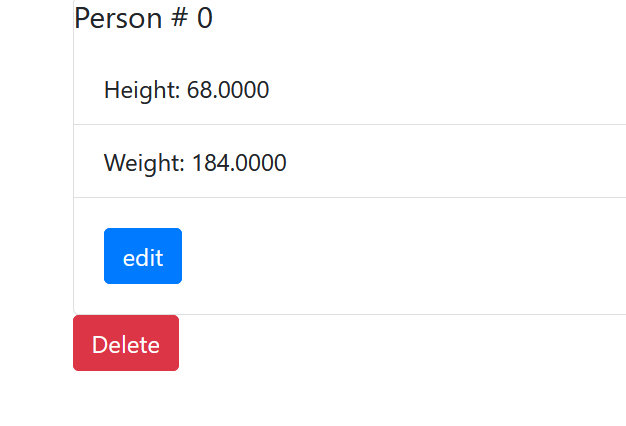

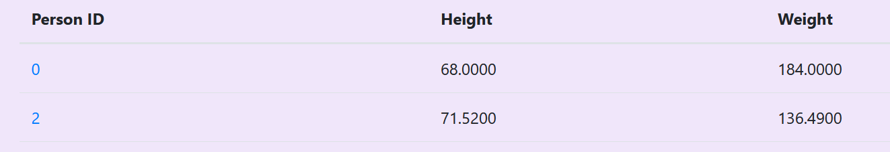

