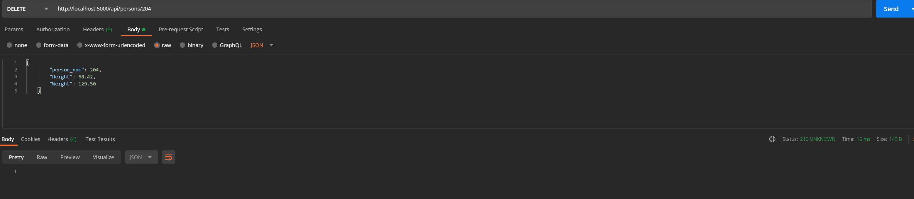
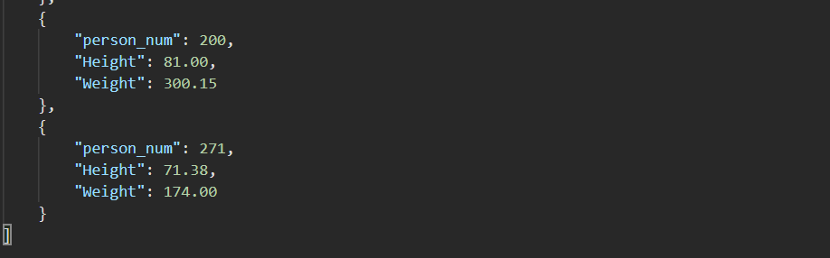

# Project Description
A project to create a flask framework to serve flask jinja template files and send http POST requests to update, add new records, and delete.  

### a. Project showing that you can view YOUR data tables in PyCharm

### b. Project running correctly in the browser displaying your homepage with your data

### c. Project running correctly in the browser displaying your data record as a view of one record

### d. Project running correctly in the browser displaying a new record added to your home page

### e. Project running correctly in the browser displaying an updated record added to your home page

#### original:

#### Edit

#### Updated

### f. Project running correctly in the browser displaying a deleted record added to your home page

